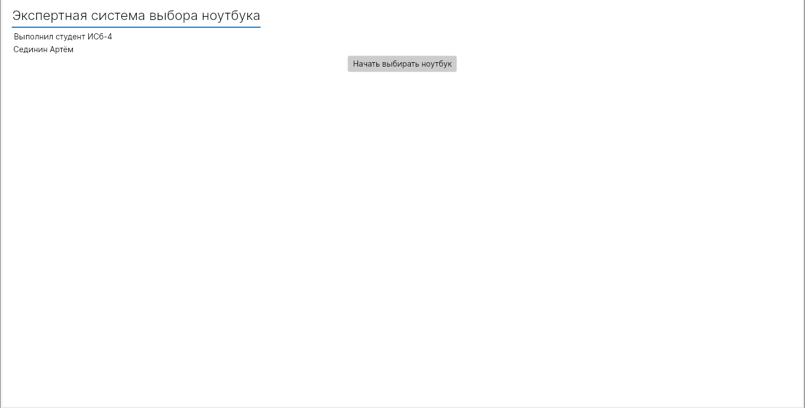
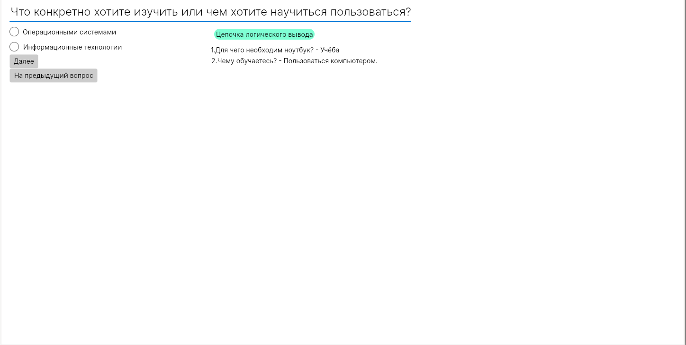

# Expert system laptop selection
+ Greeting Page.

+ SomeQuestion.

+ SomeSolution.


```
sudo apt-get install dotnet-7.0
sudo apt-get install dotnet-sdk-7.0
cd ExpertSystemLaptopSelection
dotnet restore
dotnet build
dotnet run
```
